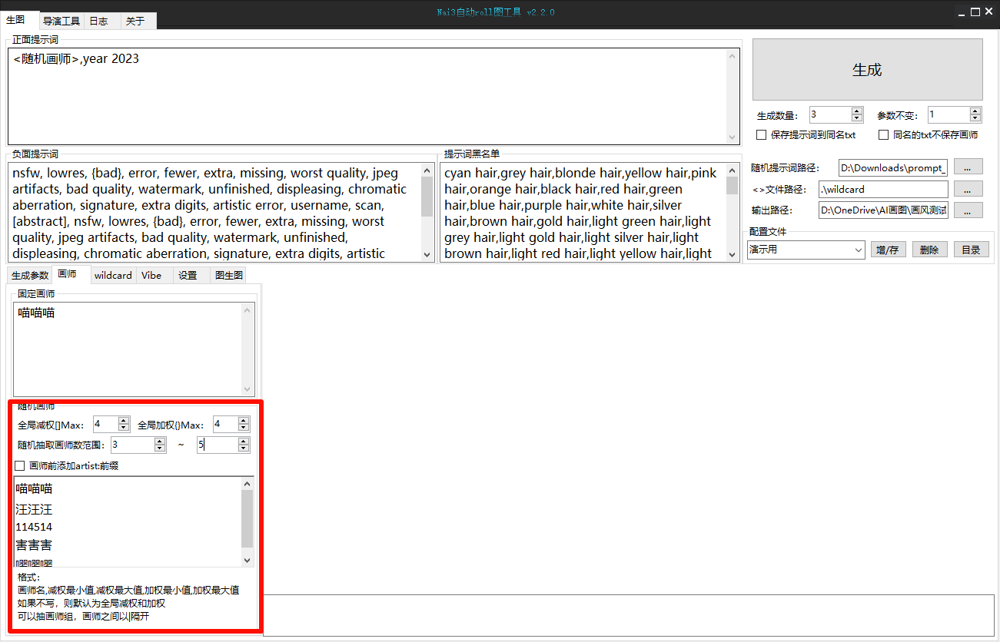
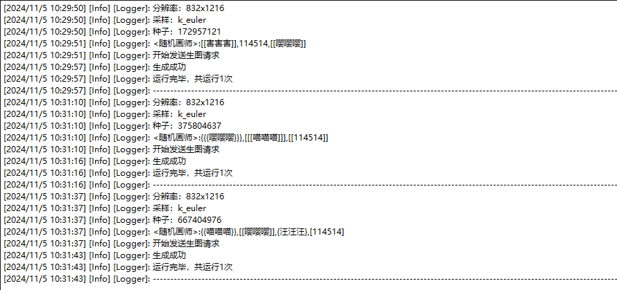
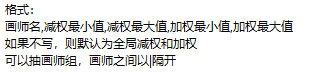

# 随机画师

## 说明

    随机画师是将其作用范围内的画师`按行`进行特殊排列整合的功能，每个抽取将以行为单位抽取

作用范围在此处



* 全局加/减权规定了画师串在被抽取时外层随机附加的`[]`和`{}`符号的最大嵌套层数
* 随机抽取的画师数范围规定了抽取时抽取的`最少画师`数量和`最多画师`数量
* 画师前添加`artist:`前缀，使得抽取的每个画师都会以`artist:`开头

## 演示

在演示中以下列文字代替画师串

```
喵喵喵
汪汪汪
114514
害害害
嘤嘤嘤
```



如日志所示，3次运行所抽取的画师数量、排列、外部的权重嵌套层数都不相同

## 模式说明



### 基础模式

当某一行只写了`画师名称`时，那么该画师在被抽到时，将会应用全局加减权的设置

### 单画师自定义权重

格式为`画师名称,减权最小值,减权最大值,加权最小值,加权最大值`

当某一行以此格式写入时，那么该画师在被抽到时，将会以后面设置的自定义的权重设置来覆盖掉全局权重设置，用于部分画师权重加高了会导致图片崩坏的情况

### 画师组自定义权重

格式可以为基础模式抽取`画师名称1|画师名称2`

也可以使用自定义权重模式抽取`画师名称1,减权最小值,减权最大值,加权最小值,加权最大值|画师名称2,减权最小值,减权最大值,加权最小值,加权最大值`

当抽中该行时，将会把该行写的画师同时抽取，适用于两个画师画风互补，连体的情况