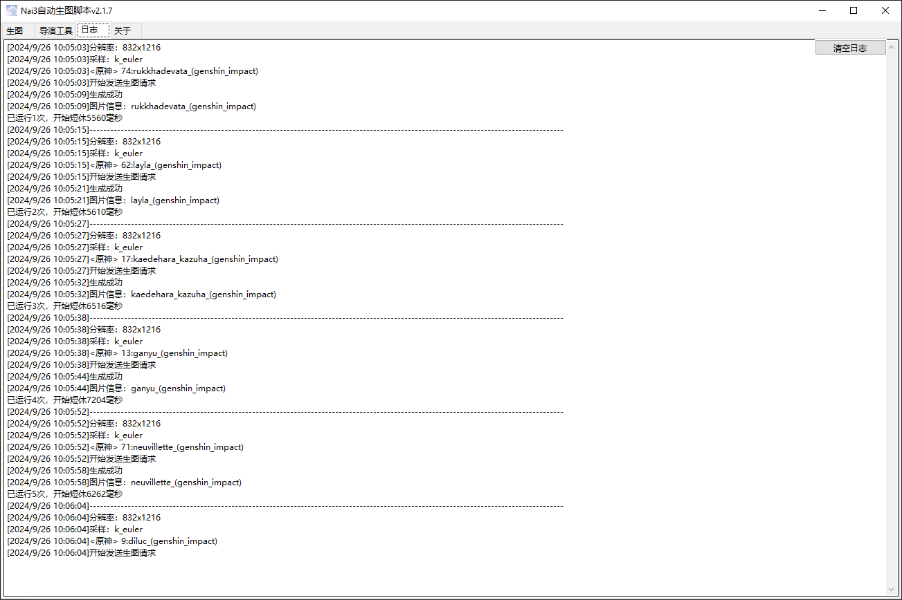

# wildcard

    本功能可以快速将文本文件内的字符替换prompt中相应格式的字符

## 基本功能

如此处，wildcard调用了一个名字为`猫.txt`的文件，`猫.txt`的内容是`1girl,loli,catgirl,white hair,blue eyes,white dresses`，所以文件的内容将会替换掉提示词中的`<猫>`

## 随机抽取

当txt文件内有多行的内容时，调用时会随机抽取一行来替换掉提示词中对应的文字

以自带的`原神.txt`为例

每次运行时都会从`原神.txt`内随机抽取一行来替换`<原神>`

## 顺序抽取

需要在wildcard调用的提示词后面加上`:顺序`，在抽取时会按从上到下的顺序按行抽取

还是以`原神.txt为例`

## 强度与组合

wildcard的字符支持和自定义的tag在同一`,区间`内组合，也支持增加强度

